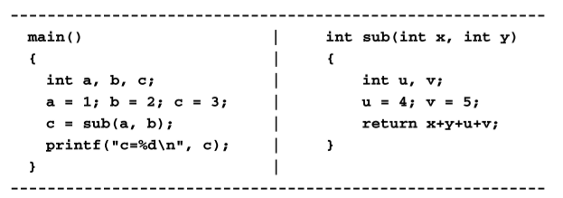
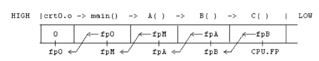

# 运行时的栈

PC(IP):指向下一个被执行的指令 

SP(SP):指向栈顶

FP(BP):指向栈中当前执行的函数

Return Value Register(AX)： 存储函数返回值的寄存器

### 过程

1. 执行a.out时，创建进程镜像(运行环境)

2. crt0.o调用main(),它将main的地址传给PC，CPU进入main();

3. PC被传入栈顶，这个PC指向crt0.o

4. 每个被编译的函数将FP推入栈中，让FP指向被保存在栈中的FP

5. 移动SP为局部变量分配空间，SP可能会额外为临时变量分配空间

6. main调用sub(),将a,b以相反的顺序用sp分配，它将sub地址传给PC，CPU进入sub

7. PC被传入栈顶，这个PC指向main()

   

8. 当sub执行完毕时，返回值返回到AX，然后开始去分配变量

   1. SP指向FP
   2. 弹出FP

9. 

